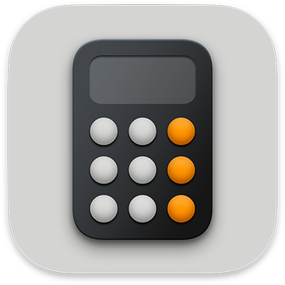
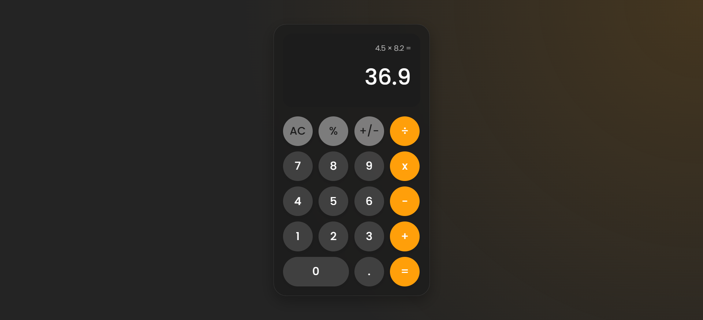

# Modern Calculator

A sleek, responsive calculator with glass morphism design, built with TypeScript and Vite. This calculator supports both light and dark modes and follows the correct order of operations (BODMAS/BIDMAS).






## Features

- **Modern Glass Morphism Design**: Sleek, transparent UI with light and dark mode support
- **Basic Arithmetic Operations**: Addition, subtraction, multiplication, and division
- **Advanced Features**:
  - Percentage calculations
  - Positive/negative number toggling
  - Proper order of operations (BODMAS/BIDMAS)
  - Decimal point support
- **Comprehensive Error Handling**:
  - Division by zero detection
  - Overflow protection
  - Invalid operation handling
  - Visual error feedback with animations
- **Responsive Design**: Works on all screen sizes from mobile to desktop
- **Accessibility**: Clear visual feedback and intuitive interface

## Usage

### Basic Operations

1. **Number Input**: Click on number buttons (0-9) to input values
2. **Arithmetic Operations**:
   - Addition: `+`
   - Subtraction: `−`
   - Multiplication: `×`
   - Division: `÷`
3. **Calculate Result**: Press `=` to see the result
4. **Clear**: Press `AC` to clear all inputs and start over

### Advanced Features

- **Percentage**: Press `%` to convert the current number to a percentage
  - When used during an operation, calculates the percentage of the first number
  - Example: `100 + 10%` equals `100 + 10` which is `110`
- **Positive/Negative Toggle**: Press `+/-` to change the sign of the current number
- **Decimal Point**: Press `.` to add a decimal point

### Error Handling

The calculator provides clear feedback for errors:

- **Division by Zero**: Displays "Cannot divide by zero" when attempting to divide by zero
- **Overflow**: Displays "Number too large" when the result exceeds the maximum value
- **Invalid Operation**: Displays "Invalid operation" for operations that cannot be performed
- **Syntax Error**: Displays "Syntax error" for malformed expressions

To recover from an error, simply press `AC` or start a new calculation.

## Development

This calculator is built with:

- **TypeScript**: For type-safe code
- **Vite**: For fast development and optimized builds
- **CSS3**: For styling with glass morphism effects
- **Poppins Font**: For modern typography

### Project Structure

```
calculator/
├── public/
│   ├── output.png       # Screenshot of the calculator
│   ├── favicon.png      # Calculator icon
│   └── vite.svg         # Vite logo
├── src/
│   ├── calculator.ts    # Core calculator logic
│   ├── main.ts          # UI interaction and event handling
│   └── style.css        # Styling with glass morphism effects
├── index.html           # Main HTML file
├── package.json         # Project dependencies
├── tsconfig.json        # TypeScript configuration
└── README.md            # Project documentation
```

### Running the Project

1. Clone the repository
2. Install dependencies:
   ```
   npm install
   ```
3. Start the development server:
   ```
   npm run dev
   ```
4. Build for production:
   ```
   npm run build
   ```

## License

MIT

## Credits

- Design inspired by modern calculator interfaces with glass morphism effects
- Built with TypeScript and Vite
